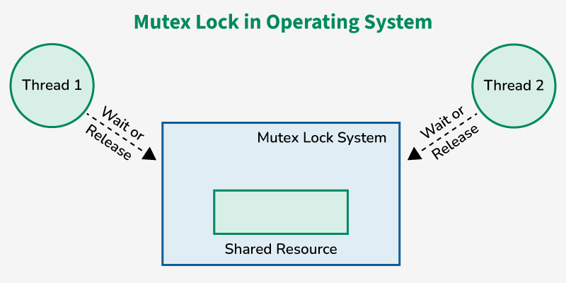
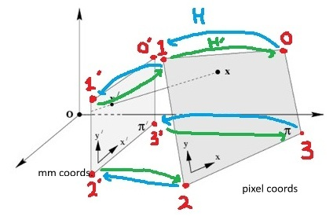
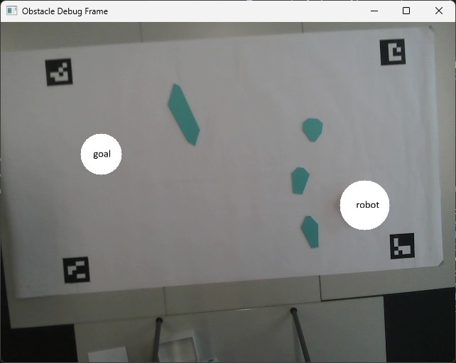
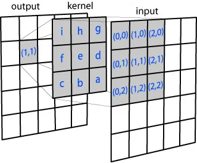

# Vision

## 1. Overview  
The vision program is called from our demo file using a single function: `getVisionCoords(timeout, showDisplay)`. We use it to set up our world boundary and find the millimeter locations of our robot, goal, and obstacle vertices.

- **timeout**: number of frames to wait before timing out  
- **showDisplay**: boolean controlling whether the live camera display is shown  

### 1.1. Vision acquisition pipeline  
The overall workflow used for vision acquisition is:

#### 1.1.1. Capture camera feed  
The program initializes a camera stream and continuously reads frames for processing.

#### 1.1.2. Detect ArUco markers  
We use **six ArUco markers** to represent system components:

- **IDs 0-3** → Operating zone corners  
- **ID 8** → Robot  
- **ID 9** → Goal  

#### 1.1.3. Build the operating zone  
The operating zone corners outline the **operating zone**, which is the boundary that the robot must stay within.

#### 1.1.4. Compute homography  
After detecting the world boundary, we apply a **homography transform** (`cv2.getPerspectiveTransform`) to flatten the camera image into a top-down plane and to convert our pixel coordinates into millimeters.

#### 1.1.5. Mask robot and goal for obstacle detection  
Before performing obstacle detection, the robot and goal markers are removed from the obstacle image:

- We locate the centers of ArUco IDs **8 (robot)** and **9 (goal)**.  
- A white circle is drawn over each marker (and the robot’s shadow) to stop them from being recognized as obstacles.  
- Obstacle detection is performed on this masked image.

#### 1.1.6. Find robot orientation
We need to find the angle of the robot when we query the vision program. Using the robot’s ArUco marker we form a vector in the robot’s forward direction and measure its angle relative to the bottom edge of the world boundary.

#### 1.1.7. Obstacle detection
We call the function `detectObstacles(obsFrame, zone, minArea)`, which takes in our mask and the minimum area threshold for a valid obstacle in pixels-squared. We blur, filter, and mask the frame to find the edges of the obstacles and draw their contours. If the contours enclose an area greater than our minimum, an obstacle instance is added to the obstacle list which is returned from this function.

#### 1.1.8. Drawing
Now that we have the pixel coordinates for our zone, robot, goal, and obstacles, we draw them using the draw helper functions. 

#### 1.1.9. Coordinate conversion
We first get all coordinates in the pixel space, then call `_extractFrameCoords(...)`, which uses `pixelToWorld` and `getWorldVerts(H)` to convert everything into millimeters before returning the final coordinate array. 

#### 1.1.10. Stability filtering  
We verify that our camera feed is stable. To avoid returning inconsistent or incorrect coordinates to the demo file, each frame's set of coordinates is added into a buffer. When the buffer contains `bufferLen = N` similar coordinates in a row, we consider the vision capture to be stable.

#### 1.1.11. Output  
After the stability check passes, the system returns four things:

1. A coordinate array in millimeters containing the corners, robot position, goal position, and obstacle vertices.  
2. The robot’s initial orientation angle in the world frame.  
3. The homography matrix used to convert pixels into millimeters.  
4. The pixel positions of the operating zone corners, used in the dashboard live feed.

### 1.2. Fast robot pose acquisition  
Once the system has been initialized using `getVisionCoords(...)`, we assume the global obstacles and the corners of our operating zone will not change. Since we are expecting this behaviour, it doesn't make sense to redo this processing every time we capture a frame. Instead, we created a lightweight function `getRobotPositionMm()` that we call whenever we want an updated robot position from the camera.

#### 1.2.1. getRobotPositionMm()  
This helper function reads a frame from the cached camera, finds the robot marker, and computes its world coordinates and orientation using the $H$ transform from earlier. It returns the robot’s x-position, y-position, orientation angle, and a validity flag. If the robot is not visible, the function returns None for the position and angle, and False for `robotSeen`; if the robot is not in the frame the program will continue to run using only odometry.

### 1.3. Shutdown and live frame access  

#### 1.3.1. stopVision()  
When the demo finishes, we can shut down the vision system using the `stopVision()` function. This stops the background camera thread, releases the video capture handle, and closes all windows.

#### 1.3.2. getLiveFrameBGR()  
This function allows other parts of the program to request the most recent camera frame at any time. We overlaid the theoretical path on top of the live feed so we can visually see how the robot is behaving.

## 2. Analysis

### 2.1. Camera acquisition and threading

#### 2.1.1. OpenCV video pipeline

The camera is accessed through OpenCV’s `VideoCapture` using a fixed camera index. `VideoCapture.read()` pulls frames and converts them into a NumPy array, which will be accessed by our program.

When making the `CameraStream` object we use:

- Frame width and height: 640×480
- Framerate: 30 fps

#### 2.1.2. Threaded camera (CameraStream) design

Instead of calling `read()` in the vision processing loop, the program uses the `CameraStream` class that does the acquisition in its own thread. Essentially:

- The camera thread continuously pulls frames from the camera and caches the latest frame.
- The vision logic program reads from that cached frame whenever it needs.

We initialize the camera once and keep a single `CameraStream` running in the background continuously grabbing the latest frame. Different functions can then access this shared stream without opening or setting up the camera themselves. For example, we have slow, heavy processing in `getVisionCoords(...)`, while `getLiveFrameBGR(...)` only requires the raw frame with no additional processing. In our current main structure, these calls occur sequentially, and we wait for `getVisionCoords(...)` to return. However, the design supports a parallel architecture where a fast function can read new frames without being blocked by heavier functions. Later in the program, this becomes more important: functions like `getRobotPositionMm(...)` and `getLiveFrameBGR(...)` can grab the most recent frame from the camera, without having to reopen the camera or wait for another function to finish running. Even though we don’t really capitalise on this to parallelize more of our program, the cached-camera design is the most robust solution.

`CameraStream` class:

- The class has:
  - `self.cap`: the `VideoCapture` object tied to the camera.
  - `self.frame`: the newest BGR frame captured.
  - `self.lock`: a `threading.Lock` protecting access to `self.frame`.
  - `self.running`: a flag that controls the capture loop.
  - `self.thread`: the background thread object.

- The `_update` method:
  - Runs in a `while self.running` loop.
  - Calls `cap.read()` to grab the next frame.
  - Acquires lock and updates `self.frame`.
  - Small sleep timer to avoid using 100% of the CPU.

- The `read` method:
  - Acquires the same lock.
  - Returns a `.copy()` of the frame buffer.

What’s the point of the lock?:

- The main thread might try to read the frame at the same time as the camera thread is writing a new one.
- Without coordination, this could produce torn frames or corrupt data.

<p align="center">
    
</p>

<p style="text-align: center;">
Mutex locking diagram (photo source: 
    <a href="https://www.geeksforgeeks.org/operating-systems/mutex-vs-semaphore/">https://www.geeksforgeeks.org/operating-systems/mutex-vs-semaphore/</a>
)
</p>

 As shown above, the lock makes sure that only one thread can access the shared `self.frame` array at a time. When a thread calls `lock.acquire()`, it either takes the lock or blocks until the other thread releases it. The main thread acquires the lock, copies `self.frame`, and releases it so the camera thread can keep capturing. The camera thread acquires the lock, writes the new frame, then releases it. As a result, the main thread never sees a partially written frame, and the camera thread never overwrites the array while it is being copied.

Even with the lock, once `read()` returns the main thread may spend some time processing the frame (for example, during ArUco detection). If we returned a reference to `self.frame` instead of `self.frame.copy()`, the camera thread might modify that array while the program is still processing it.

#### 2.1.3. Camera warm-up and exposure behaviour

If we immediately started running ArUco detection on the unstable frames generated right after the camera opens, the early detections would be inconsistent and delay the rest of our vision processing program. To avoid this, we discard the first chunk of frames captured after opening the camera. While discarding we initiate a small sleep per frame.

```python
warmup_frames = 30
for _ in range(warmup_frames):
  ok, _ = self.cap.read()
  if not ok:
    break
  time.sleep(0.02)
```

This does two things:

1. Gives the camera enough time to stabilize exposure, gain, and white balance.
2. Avoid over-using the CPU, similar to how we used the sleep timer in the `_update` method earlier.

After exiting the for-loop, the frames are closer to their steady state, which improves ArUco and obstacle detection later in the program.

### 2.2. ArUco marker detection

#### 2.2.1. ArUco dictionaries and encoding

An ArUco marker is a QR-code-esque identifier typically used for computer vision applications:

- A black border defines the region.
- The interior is a binary grid encoding an ID.
- It has redundancy and error correction:
  - If some cells are partially blocked or corrupted by noise, the decoder can still recover the ID.
  - The orientation of the marker can be deduced since the binary pattern only matches one orientation.

<p align="center">
    
</p>

<p style="text-align: center;">
Example ArUco marker (photo source: 
    <a href="https://chev.me/arucogen/">chev.me/arucogen</a>
)
</p>


The dictionary that we use ("DICT_4X4_50") contains:

- The size of the inner grid (4x4).
- The number of valid patterns and how they map to IDs, in our case 0-49.
- Each marker pattern is different enough from the others that the camera doesn't confuse them.

In our system:

- IDs 0-3 are the operating zone corners [bottom-left = 3, bottom-right = 2, top-right = 1, top-left = 0].
- ID 8 is the robot.
- ID 9 is the goal.

#### 2.2.2. Detection steps (`detectAruco`)

The `detectAruco` function implements the ArUco detection pipeline, this is all internal to OpenCV, so we didn't write the code for this. However, the method OpenCV uses is explained below:

##### 1. **Conversion to greyscale**

ArUco markers only store information in black & white intensity as seen above, so OpenCV turns the three BGR channels into a single greyscale channel:

$$
I(x,y) = 0.114\,B(x,y) + 0.587\,G(x,y) + 0.299\,R(x,y)
$$

Where:

- $I(x,y)$: greyscale intensity at pixel (x,y)
- $B(x,y),G(x,y),R(x,y)$: blue, green, and red channel intensities at pixel (x,y)
- $0.114, 0.587, 0.299$: channel coefficients used by OpenCV

I found the coefficients in the OpenCV documentation at:  
https://docs.opencv.org/4.x/de/d25/imgproc_color_conversions.html

**Why convert to greyscale:**  
- ArUco markers only encode information through black & white intensity, not colour. Using greyscale makes the filtering process easier since the algorithm only separates “dark” from “light”,  rather than processing three colour channels.
- Greyscale removes colour-specific noise and produces cleaner edges for thresholding and contour detection.

##### 2. **Detector initialization**

OpenCV loads the `DICT_4X4_50` dictionary.  
This dictionary restricts detection to exactly 50 known 4×4 bit patterns (IDs 0-49)

##### 3. **Looking for ArUco markers**

###### a. **Adaptive thresholding**

Conceptually, ArUco detection applies adaptive thresholding (local mean thresholding) to handle uneven lighting:

$$
T(x,y) = \frac{1}{|N|} \sum_{(u,v)\in\N} I(u,v) - C
$$

Where:

- $T(x,y)$: threshold at pixel (x,y)
- $N$: local neighbourhood window
- $|N|$: number of pixels in the neighbourhood
- $I(u,v)$: greyscale intensity at neighbour pixel (u,v)
- $C$: constant offset to bias the threshold

###### b. **Contour filtering**

After thresholding, the image is binarized with pixels either being black (0) or white (255). OpenCV finds areas of the image containing boundaries between white and black regions, then it "walks" along these edges and returns its path (the contour). Most contours in the image are not ArUco markers, so OpenCV filters contours based on:

- Area  
- Convexity  
- Approximate shape

###### c. **Warping and bit sampling**

Initially the contour is tilted / skewed, each candidate marker is rectified to a square via a homography, so that the inner code grid can be sampled on a regular 4×4 grid. The H-transform turns each contour into a perfect square via:

$$
\begin{bmatrix}
x' \\[4pt]
y' \\[4pt]
w'
\end{bmatrix}
=
H
\begin{bmatrix}
x \\[4pt]
y \\[4pt]
1
\end{bmatrix},
\qquad
H =
\begin{bmatrix}
h_{00} & h_{01} & h_{02} \\
h_{10} & h_{11} & h_{12} \\
h_{20} & h_{21} & h_{22}
\end{bmatrix}
$$

$$
x_{\text{norm}} = \frac{x'}{w'}, 
\qquad
y_{\text{norm}} = \frac{y'}{w'}
$$

$$
x_{\text{norm}}
=
\frac{
h_{00}x + h_{01}y + h_{02}
}{
h_{20}x + h_{21}y + h_{22}
},
\qquad
y_{\text{norm}}
=
\frac{
h_{10}x + h_{11}y + h_{12}
}{
h_{20}x + h_{21}y + h_{22}
}.
$$

Where the homography parameters are defined as:

- $h_{00}, h_{01}$: control horizontal scaling, rotation, and skew  
- $h_{10}, h_{11}$: control vertical scaling, rotation, and skew  
- $h_{02}, h_{12}$: control translation (shifting the warped image)  
- $h_{20}, h_{21}$: encode perspective tilt (how much lines "converge")  
- $h_{22}$: normalization term (usually set to 1)

And $w'$ is a scale factor used to turn the coordinates back into pixel coordinates after the transform.

Homography computation:

Given 4 corner points in the image $(x_i, y_i)$ and the 4 corner points of a perfect square $(X_i, Y_i)$, the transform satisfies:

$$
\begin{bmatrix}
X_i \\ Y_i \\ 1
\end{bmatrix}
\sim
H
\begin{bmatrix}
x_i \\ y_i \\ 1
\end{bmatrix}.
$$

In general, a homography with four point correspondences is solved using a Direct Linear Transform (DLT), and intensities at non-integer locations are obtained by bilinear interpolation. Conceptually, this is what happens when OpenCV rectifies the marker and samples the inner grid:

$$
I(x,y) = 
w_{00} I(\lfloor x \rfloor,\lfloor y \rfloor)
+ w_{01} I(\lfloor x \rfloor,\lfloor y \rfloor+1)
+ w_{10} I(\lfloor x \rfloor+1,\lfloor y \rfloor)
+ w_{11} I(\lfloor x \rfloor+1,\lfloor y \rfloor+1)
$$

Where:

- $I(x,y)$: intensity at fractional coordinate (x,y)
- $\lfloor x \rfloor,\lfloor y \rfloor$: nearest integer pixel locations
- $w_{ij}$: interpolation weights (sum to 1)

The homography transform paired with the bilinear interpolation returns the intensity value of the sub-pixel brightness. This will be used to determine whether this sub-pixel is a part of the ArUco code.

###### d. **Dictionary matching**

The sampled 4×4 bits form a candidate pattern $M$. OpenCV compares this against each dictionary entry $D_k$ to ensure that only one ID is matched to what we have identified:

$$
d_H(M, D_k) = \text{number of bit positions where } M \neq D_k
$$

Where:

- $M$: extracted 4×4 bit matrix
- $D_k$: k-th dictionary pattern
- $d_H$: Hamming distance (bit mismatches)

##### 4. **Output structure**

The detector returns `ids`, a list of IDs that were found in the frame, and `corners`, a list containing the corners for each of the ArUco markers in pixel-coordinates.

We compute the marker center as the mean of the four corners:

$$
c = \frac{1}{4} \sum_{k=0}^{3} p_k
$$

Where:

- $p_k$: k-th corner point (2D pixel coordinate)
- $c$: computed marker center

### 2.3. Operating zone and coordinates

#### 2.3.1. Zone definition from markers 0-3

The operating zone for our robot is defined by the four corner ArUco markers:

- IDs 0, 1, 2, 3 sit at the corners of the physical board.
- The code constructs a `zone` dictionary where:
  - `zone["isComplete"]` is true when all corners are detected.
  - `zone["missing"]` is a list of the missing corner IDs.
  - `zone["corners"]` is an ordered list of the pixel centers of the corner markers.

The order is forced even if the IDs are returned in a different sequence because:

1. Homography transform assumes that the nth pixel corner corresponds to the nth world corner. If the order is wrong, the homography will warp the board incorrectly.
2. When we draw the polygon representing the zone, we want a simple counter-clockwise loop that does not self-intersect; consistent ordering guarantees that.
3. When we return the list to `demo.py`, the global navigation program expects all polygons to be counter-clockwise.

#### 2.3.2. World coordinate system

The world coordinate system is in millimeters, and the size of it is set by the physical dimensions we chose to use on our background sheet of paper. The known width and height of our operating zone are set as constants:

- `widthMm` ~ 1255 mm
- `heightMm` ~ 740 mm

The coordinates of the four board corners in world space are:
  - (0, 0) = bottom-left
  - (widthMm, 0) = bottom-right
  - (widthMm, heightMm) = top-right
  - (0, heightMm) = top-left

All points inside the operating zone can then be expressed in millimeters after finding the suitable homographic transform.

### 2.4. Homography and pixel to world coordinate mapping

#### 2.4.1. Homography transform

As discussed earlier in Section 2.2.2 ("Looking for ArUco markers"), the homography transformation accounts for when the camera is not perfectly orthogonal to the operating zone, if there is any rotation of the board, and scaling differences that happen as you move out of the center of the camera's vision. For our project, the problem was that we needed our operating zone to have a uniform scale so that our Thymio could be sent waypoints in millimeters anywhere in the zone; the $H$ transform solves this:

<p align="center">
    
</p>

<p style="text-align: center;">
Homography example (photo source: 
    <a href="https://mattmaulion.medium.com/homography-transform-image-processing-eddbcb8e4ff7">https://mattmaulion.medium.com/homography-transform-image-processing-eddbcb8e4ff7</a>
)
</p>

Similarly to the ArUco codes:
- The zone corner pixel centers (`zone["corners"]`) are the source points.
- The world corner coordinates are the destination points.
- `cv2.getPerspectiveTransform` takes these and solves for $H$.

To map a pixel point pt = (x, y) into millimeter world coordinates we form a $1\times 1\times 2$ array to pass into `cv2.perspectiveTransform`, OpenCV multiplies $H$ by $[x, y, 1]^T$ internally and returns the result, finally it normalizes by the third coordinate $w'$ to yield $(X, Y)$. It returns (X_mm, Y_mm) which is the position in millimeters. We also use the inverse of the $H$ transform to convert our path (in mm) back into pixel coordinates for our dashboard.

### 2.5. Robot pose estimation

#### 2.5.1. Robot position and orientation

The robot has an ArUco marker with ID 8 and using `centerMap[8]` we get the pixel center. To convert to world position we use `pixelToWorld(center_pixel, H)` and the robot’s estimated position (x_mm, y_mm) is returned. We find the orientation of the robot using the center of the top edge as the forward direction. Using the ArUco corner ordering convention we:

1. Take the corners for ID 8 from `cornerMap`, index 0 is top-left and index 1 is top-right.
2. Compute the midpoint of these two corners in pixel coordinates.
3. Convert:
   - The marker center to world coordinates: (cx, cy).
   - The midpoint of the top edge to world coordinates: (tx, ty).
4. Create a vector from robot center to the edge midpoint:
   - dx = tx - cx
   - dy = ty - cy
5. Compute the orientation angle:
   - $\theta$ = atan2(dy, dx)

$\theta$ is defined in the world coordinates by:

- $\theta$ = 0 when the robot faces along +X (parallel to zone bottom edge facing the right).
- $\theta$ increases counter-clockwise:
  - $\pi/2$: robot faces +Y (towards the top of the board).
  - $\pi$: robot faces -X (leftwards).
  - $3\pi$/2: robot faces -Y (downwards).

The ArUco marker is attached to the robot so that its center is roughly in the same position as the robot’s center of rotation and its top edge points in the robot’s forward direction. If the marker is misaligned then $\theta$ will have a constant offset with the real forward heading of the robot.

### 2.6. Obstacle detection and processing

#### 2.6.1. Colour-space and masking choices

Obstacle detection is performed directly in BGR space with a Gaussian blur that reduces noise and `cv2.inRange` is used with a lower and upper threshold on the B, G, and R channels. We chose to stay in BGR rather than convert to HSV for simplicity. The obstacle colour was distinct enough that direct BGR thresholds were easy to tune by trial and error. Additionally, the system uses a binary zone mask so that objects or noise outside the world boundary do not show up as obstacles. 

Before obstacle detection, the robot and goal markers are painted over with white circles on the obstacle frame:

<p align="center">
    
</p>

We used the paint-over to stop the ArUco markers and the robot's shadow from being detected as obstacles. The radius was chosen based on the size of the box created by the marker’s corners; it was scaled to cover the marker and nearby shadows.

#### 2.6.2. Blurring

A Gaussian blur is applied to the BGR image before applying the colour threshold. Gaussian blur replaces each pixel with a weighted average of its neighbours. It smooths out small changes in intensity and colour due to sensor noise or texture. Finally, it limits the amount of isolated pixels that may be classified as an obstacle. The kernel size (5x5) was chosen because it is large enough to smooth out noise at the pixel scale, but it is small enough to keep the edges of obstacles.

<p align="center">
    
</p>

<p style="text-align: center;">
Gaussian blur example (photo source: 
    <a href="https://hackaday.com/2021/07/21/what-exactly-is-a-gaussian-blur/">https://hackaday.com/2021/07/21/what-exactly-is-a-gaussian-blur/</a>
)
</p>

$$
I_{\text{blur}}(x,y)
=
\sum_{i=-2}^{2}
\sum_{j=-2}^{2}
G_{\text{5×5}}(i,j)\, I(x+i,\, y+j)
\qquad
G_{\text{5×5}} =
\frac{1}{273}
\begin{bmatrix}
1 & 4 & 7 & 4 & 1 \\
4 & 16 & 26 & 16 & 4 \\
7 & 26 & 41 & 26 & 7 \\
4 & 16 & 26 & 16 & 4 \\
1 & 4 & 7 & 4 & 1
\end{bmatrix}
$$

We apply a $5\times 5$ Gaussian blur by taking each pixel and combining it with the surrounding twenty-four neighbours using the fixed weights supplied by OpenCV. The weight matrix approximates a Gaussian distribution. For each pixel, we multiply every neighbour by the corresponding weight and add the results. The weights are such that they sum to one, which keeps the image brightness the same.

#### 2.6.3. Colour thresholding

After blurring, obstacle detection is performed by applying `cv2.inRange` directly in the BGR colour space. This function compares each pixel against a lower and upper BGR bound chosen earlier:

`mask = cv2.inRange(blurred, lowerBGR, upperBGR)`

Pixels with Blue, Green, and Red channel values all within the ranges are set as 255, and everything else is set as 0. This is similar to the binarization step used in ArUco detection, we reduce the image to a binary mask so later steps (morphology and contours) operate on clean regions. It is then passed into our morphological functions, where the mask will be cleaned up so our contour detection returns the obstacles we are interested in. 

#### 2.6.4. Morphological operations and findContours

After thresholding we clean up the mask using:

```python
kernel = cv2.getStructuringElement(cv2.MORPH_ELLIPSE, (5, 5))
mask = cv2.morphologyEx(mask, cv2.MORPH_CLOSE, kernel, iterations=2)
mask = cv2.morphologyEx(mask, cv2.MORPH_OPEN, kernel, iterations=1)
```
The elliptical kernel defines the neighbourhood used for smoothing. An ellipse was chosen because it produces natural-looking shapes that match our obstacles better than a square kernel. The first operation is closing, which fills small holes and connects small gaps so that each obstacle turns into a solid region. Closing is applied twice to ensure that obstacles broken by thresholding are repaired. The second operation is opening, which removes small isolated noise pixels and smooths the edges of the cleaned regions.

We then extract the outline of each obstacle using `findContours(mask, cv2.RETR_EXTERNAL, cv2.CHAIN_APPROX_SIMPLE)`:

- Retrieval mode: external contour only which returns the outer boundary of each obstacle and ignores any holes.
- Approximation method: chain approximation reduces the number of stored boundary points and keeps only the essential outline.

Each contour represents an obstacle. The system then computes the area of each contour and filters them using two thresholds:

- A minimum area (minArea).
- A maximum area (maxArea).

Small areas usually correspond to noise or artifacts, and large areas mean that there are likely lighting problems and that large sections of our zone are being detected as obstacles. Contours within the acceptable range are turned into `Obstacle` objects and added to the list.

#### 2.6.6. Polygon approximation

Each `Obstacle` object simplifies its contour into a smaller polygon using the `approxPolyDP(self.contour, epsilon, True)`:

```python
if self._verts is None:
  peri = cv2.arcLength(self.contour, True)
  epsilon = 0.02 * peri
  approx = cv2.approxPolyDP(self.contour, epsilon, True)

  pts = [(float(p[0][0]), float(p[0][1])) for p in approx]
```

Where:
- peri is the perimeter length of the contour.
- epsilon is the maximum deviation allowed for the approximation.
- approx is the new simplified polygon.
- pts is the list of (x,y) in pixel coordinates.

Benefits of using a simplified polygon approximation are:

- Eliminates unnecessary detail in the contour, small variations on the boundary are removed.
- Produces obstacle polygons with a reasonable number of vertices.
- Gives stable representation of obstacle vertices for repeated trials.

After approximation, the obstacle vertices are “snapped” to a pixel grid. Each corner is rounded to the nearest multiple of a small grid spacing (we used 3), and vertices that end up close to each other are merged to further simplify the obstacle:

```python
grid = 3
snapped = [
    (int(round(x / grid) * grid), int(round(y / grid) * grid))
    for (x, y) in pts
]

merged = []
mergeDist = 3
for x, y in snapped:
    if not merged:
        merged.append([x, y])
        continue

    found = False
    for v in merged:
        dx = x - v[0]
        dy = y - v[1]
        if dx * dx + dy * dy <= mergeDist * mergeDist:
            v[0] = int(round((v[0] + x) / 2))
            v[1] = int(round((v[1] + y) / 2))
            found = True
            break

    if not found:
        merged.append([x, y])

self._verts = [(vx, vy) for vx, vy in merged]
```

#### 2.6.7. Obstacle class

Once the polygon vertices are defined in pixel coordinates, we convert them to world coordinates using the same homography $H$ used for markers. `pixelToWorld` is called and the resulting world coordinates are added to a list. The vertices are then sorted by:

1. Computing the centroid.
2. For each vertex, compute the angle from centroid to vertex.
3. Sort by this angle to obtain counter-clockwise order of vertices.
4. Find the bottom-left vertex (lowest Y, then lowest X), and rotate the list so that this vertex is first.

Why this ordering?

1. Consistent vertex labeling regardless of detection order.
2. We use Shapely to draw the polygons for path planning, we follow the convention of defining polygons with counter-clockwise vertices to avoid ambiguity and to match the expectations of our path-planning code. This is expanded on further in the global navigation section.

The final representation of an obstacle in the coordinate array is as a set of rows:

- type: "vertex"
- polygon ID: "polyX"
- vertex label: "1", "2", ...
- x_mm, y_mm: world coordinates in millimeters

### 2.7. Stability filtering and robustness

#### 2.7.1. Motivation for temporal filtering

The ArUco detector occasionally misses a marker if it is partially blocked or blurry and obstacle extraction can be sensitive to lighting changes. If we returned vision coordinates using one frame:

- Corners may disappear and reappear.
- Obstacles could jump around.
- Inconsistent robot and goal positions and orientations.

To avoid this, we used a buffer that stores frames and compares the coordinate values to see if the camera feed is stable. Until then, the system collects frames and updates the buffer.

```python
def obstaclesAreSimilar(obsArr1, obsArr2, tol=50.0):
  if len(obsArr1) != len(obsArr2):
    return False
  for r1, r2 in zip(obsArr1, obsArr2):
    if r1[2] != r2[2] or r1[1] != r2[1]:
      return False
    x1, y1 = round(r1[3], 1), round(r1[4], 1)
    x2, y2 = round(r2[3], 1), round(r2[4], 1)
    if abs(x1 - x2) > tol or abs(y1 - y2) > tol:
      return False
  return True
```

#### 2.7.2. Buffer design and stability

The system maintains a buffer `coordBuf` of the last N coordinate arrays. Each element is the array with the coordinates of the corners, robot, goal, and obstacle vertices.

When a new coordinate array `coords` is available, the code compares the obstacle coordinates to those held in the last buffer entry. We extract array rows where type == "vertex" and check that the same number of obstacle vertices are present, IDs and labels match, and the positions of corresponding vertices are within our tolerance of 50 mm. We chose 50 mm as a tolerance because it is large enough to ignore minor detection noise, but small enough that obstacles can't “jump” to a different location and still be considered stable. If the new obstacles are within our tolerance they are appended to the buffer. If they aren't within our tolerance, the buffer is reset to contain just the new frame. Once the buffer has N similar elements, the system checks that all entries are similar to the first one:

- If yes, our feed is stable and we can return these coordinates to the demo file. 
- If no, try again.

We are able to toggle latency and stability by modifying our hardcoded `bufferLen` values:

- Increase bufferLen:
  - Increase stability, function takes longer to get stable coordinates.
- Decrease bufferLen:
  - Might have errors in our detection, but will return faster.

We adjusted `bufferLen` throughout our testing, when obstacle detection was noisy we increased it to ensure stability. When detection was reliable we decreased it to speed up the program. 

### 2.8. Fast robot pose acquisition

Once the vision system has been initialized and the homography has been computed, the heavy processing does not need to be repeated every time we want to update the robot’s position. The function `getRobotPositionMm()` provides an easy way to fetch the robot’s pose using the cached camera and homography transformation. The function returns x_mm, y_mm, theta, robotSeen; robotSeen is a boolean flag that is used to determine whether the camera can be used for position determination.

#### 2.8.1. Requirements and frame acquisition loop

This function needs:

- `VISION_CAMERA`: the background `CameraStream` object (Section 2.1).
- `VISION_H`: the pixel to world homography matrix computed during initialization (Section 2.4).

The function retrieves the newest frame from the camera:

```python
frame = VISION_CAMERA.read()
if frame is None:
    time.sleep(0.01)
    continue
```

This matches the locking behaviour from earlier. If no frame is ready, wait; otherwise process it.

#### 2.8.2. Detecting the robot marker

Aruco detection is applied to the frame:

```python
_, centerMap, cornerMap, _ = detectAruco(frame)
```

If the robot marker (ID 8) isn't detected:

```python
return None, None, None, False
```

#### 2.8.3. Coordinate conversion and robot orientation

The robot’s pixel center is mapped into world coordinates using the cached homography:

```python
robotWorld = pixelToWorld(centerMap[ROBOT_ID], VISION_H)
x_mm, y_mm = robotWorld

```

The orientation procedure is the same as described earlier:

1. Compute the midpoint of the top edge of the robot marker.
2. Convert the midpoint into world coordinates.
3. Make the vector from robot center to the midpoint.
4. Compute the heading using `atan2`.

```python
topMidPx = (rCorners[0] + rCorners[1]) / 2.0
topMidWorld = pixelToWorld(topMidPx, VISION_H)
dx = topMidWorld[0] - x_mm
dy = topMidWorld[1] - y_mm
theta = math.atan2(dy, dx)
```

### 2.9. Live frame acquisition

#### 2.9.1. getLiveFrameBGR() function

A function to get the latest frame from the cached camera. Used alongside the inverse $H$ transform to turn the path into pixel coordinates from world coordinates.

```python
def getLiveFrameBGR():
    """return the latest BGR frame from the cached CameraStream."""
    global VISION_CAMERA
    if VISION_CAMERA is None:
        raise RuntimeError(
            "init world error"
        )
    return VISION_CAMERA.read()
```