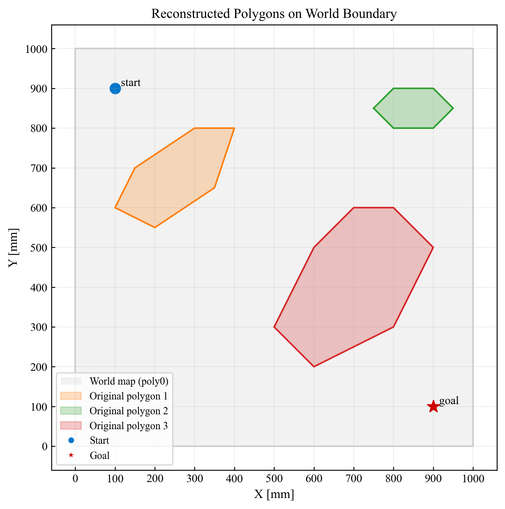
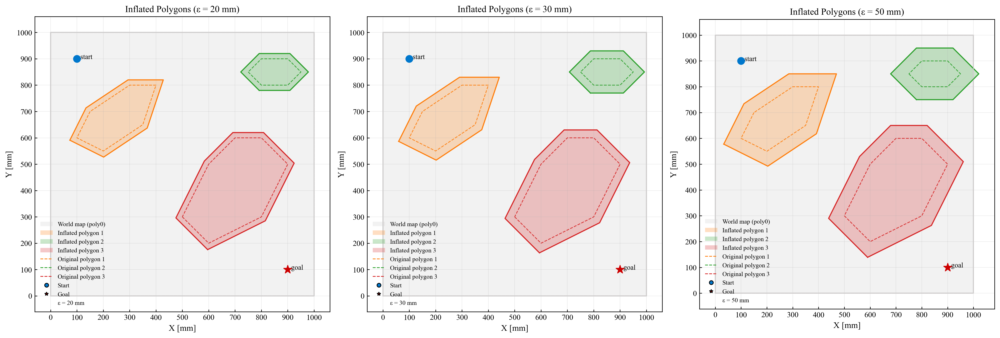
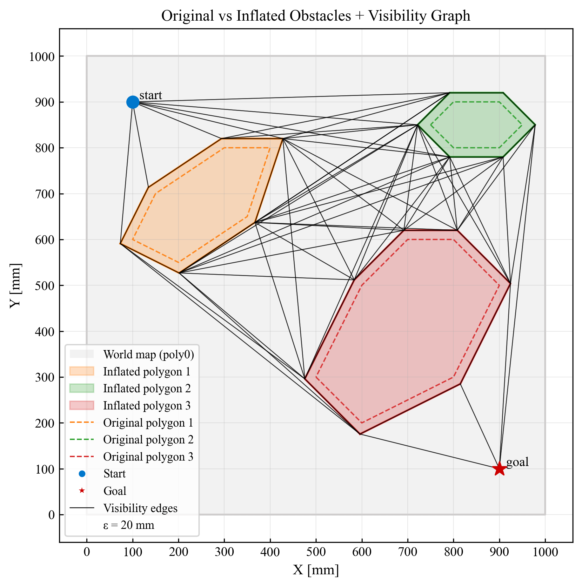
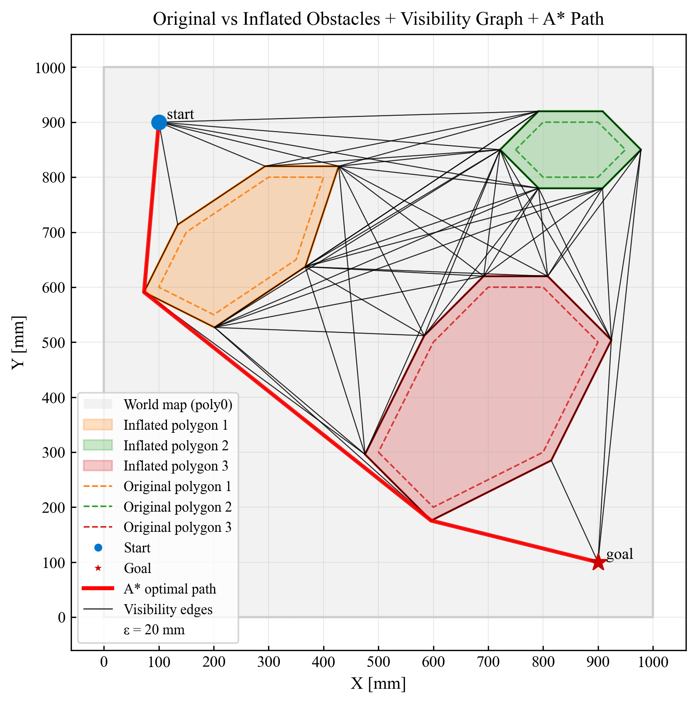
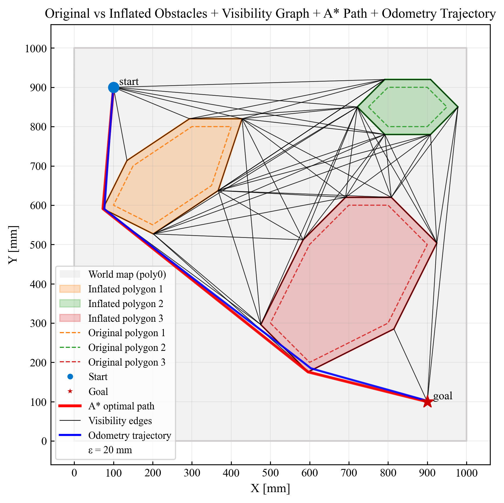

## Global Navigation: Global Path Planning

In this section, we describe the design and implementation of the global navigation module. Its purpose is to compute a collision-free, geometrically optimal path for the Thymio robot, based on the environment reconstructed by the Vision Module.

Our approach uses a Visibility Graph combined with A* search, as introduced in the course. Obstacles detected in the Esplanade construction scenario (e.g., excavators, transport vehicles, gravel piles) are abstracted as convex polygons, allowing efficient geometric reasoning.

We use the [Shapely library](https://shapely.readthedocs.io/en/stable/)
for computational geometry (e.g., `Polygon`, `LineString`, intersection tests), which greatly simplifies handling polygonal obstacles.

### Chosen Planning Approach: Visibility Graph
##### Advantages

- Produces the geometrically optimal path in continuous space.

- Requires far fewer nodes compared to grid-based planning.

- Generates a compact list of waypoints, suitable for robot execution.

- Works especially well with convex polygonal obstacles.

##### Limitations

- Requires precise polygon vertices from the Vision Module.

- Robot modeled as a point requires obstacle inflation to avoid collisions.

- Path must be recomputed when obstacles move.

### Overview of the Planning Pipeline

The global planner consists of the following stages:

1. Input from Vision Module

2. Check orientation of polygons (CCW)

3. Construct polygon objects

4. Inflate polygons by ε

5. Extract nodes (vertices + start + goal)

6. Build the Visibility Graph (Shapely intersection tests)

7. Run A* on the graph

8. Return optimal path to the Control Module

9. The final output is a list of waypoints in world coordinates (mm).

### 1. Input from the Vision Module

The Vision Module provides obstacle vertices as well as start and goal coordinates in the format:

`type, id, label, x, y`

Example:

    poly1, poly1, A, 123.4, 567.8
    poly1, poly1, B, 200.0, 540.0
    start, start, S,  50.0, 900.0
    goal,  goal,  G, 900.0,  60.0

These coordinates are already converted into the world coordinate system in millimeters using camera calibration.

### 2. Polygon Orientation (CCW)

Shapely requires polygons to have consistent vertex ordering.
We ensure counter-clockwise (CCW) orientation using the signed area method:

\begin{array}{l}
A = \frac{1}{2} \sum_{i=1}^{n} \left( x_i y_{i+1} - x_{i+1} y_i \right)
\end{array}

- If \( A > 0 \) → polygon is CCW  
- If \( A < 0 \) → reverse vertex order  

All polygons are therefore normalized to CCW orientation.

Source: [The Shoelace Algorithm](https://www.101computing.net/the-shoelace-algorithm/).

### 3. Constructing Polygons

We reconstruct each obstacle as a Shapely `Polygon`.

This allows:

- robust collision detection

- buffering / inflation

- geometric operations

- clean visualization

We also render the reconstructed map for debugging and verification.

  

### 4. Obstacle Inflation

To avoid collisions, obstacles are expanded in configuration space by an inflation parameter ε (robot safety margin).

Shapely's buffer operation approximates Minkowski sum:

\begin{array}{l}
\tilde{\mathcal{O}} = \mathcal{O} \oplus B(\varepsilon)
\end{array}

We use:

     poly.buffer(epsilon, join_style=2, resolution=1)

which preserves sharp edges and limits vertex growth.

The inflated polygons create the configuration-space map used for planning. 

  

Source: [Wikipedia](https://en.wikipedia.org/wiki/Minkowski_addition)

### 5. Node Extraction

We define nodes as:

- all vertices of inflated obstacles except the outer boundary poly0

- the start coordinate

- the goal coordinate

These are stored as:

    node_coords = [(x0, y0), ...]
    node_labels = ["poly1_0", ..., "start", "goal"]

The outer map boundary is excluded since its vertices are not used for visibility edges.

### 6. Building the Visibility Graph

For every pair of nodes `(i,j)`, we test whether the segment connecting them is obstacle-free.
We rely on Shapely:

- `LineString(segment).crosses(polygon)`

- `LineString(segment).within(polygon)`

- bounding-box prechecks

We allow segment–obstacle tangency (parallel to edges) since obstacles are already inflated.

Helper functions:

- `segment_visibility(i, j)`

- `euclidean_distance(i, j)`

- `build_neighbors(...)`

The adjacency list defines the Visibility Graph.

Example neighbor count:

    Node 12 (poly3_0) has 18 neighbors
    Node 212 (start) has 55 neighbors
    Node 213 (goal) has 30 neighbors

A visualization confirms correct visibility edge construction.

  

### 7. A* Path Planning

We apply A* search on the visibility graph.
The cost function is:

\begin{array}{ll}
f(n)=g(n)+h(n)
\end{array}

Where:

- $g(n)$: accumulated distance from start  
- $h(n) = \| n - \text{goal} \|_2$: Euclidean distance heuristic

The heuristic is admissible and consistent, ensuring optimality.

Although turn penalties can be included, the visibility graph already contains few nodes and produces nearly straight-line paths, making additional penalties less necessary.

  

### 8. Output and Integration with the Control Module

Running A* yields a waypoint sequence:

    [(10.0, 900.0), (75.3, 590.1), (595.6, 176.6), (900.0, 10.0)]

This path is sent to the Control Module as the global plan.

Below is an example comparing:

- the optimal A* path (red),

- the measured odometry of the robot (blue),

- and the inflated polygonal environment:

  

#### Real-World Execution Test

The Thymio successfully followed the computed trajectory.
We sampled odometry every 500 ms (x, y, θ, v, ω, timestamp) and overlaid the result.

Observations:

- The odometry trace follows the theoretical path closely.

- Expected drift occurs, consistent with “blind” dead-reckoning behavior.

- At one moment, a wheel briefly lost contact due to table height mismatch, causing an odometry jump.

- The experiment confirms that Thymio’s encoder-based odometry and our coordinate transformations function correctly.

- Accurate localization requires vision-based pose estimation, integrated later in the project.