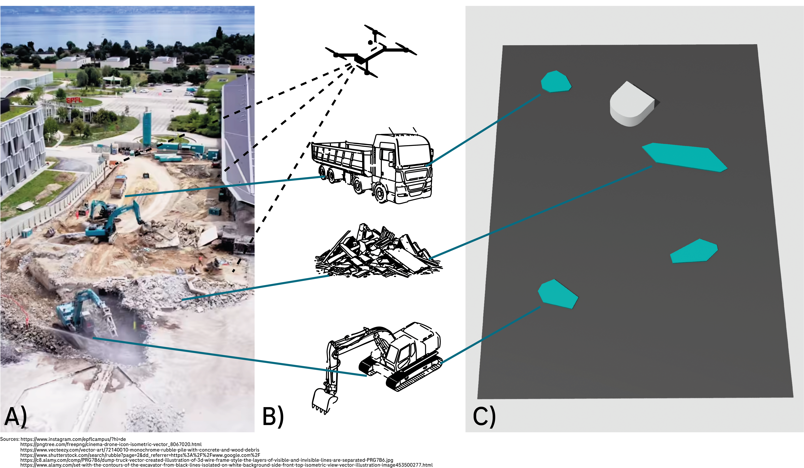

# **MOBILE ROBOTS Project Report**

**Group 38**

| **Name** | **ID / Student Number** | **Email** |
|---------|--------------------------|-----------|
| Name Surname | 123456 | name.surname@example.com |
| Name Surname | 234567 | name.surname@example.com |
| Name Surname | 345678 | name.surname@example.com |
| Name Surname | 456789 | name.surname@example.com |

### **Table of Contents**

1. [Introduction](#introduction)
2. [Vision](#vision)
3. [Global Navigation](#global-navigation)
4. [Motion Control](#motion-control)
5. [Local Navigation](#local-navigation)
6. [Filtering](#filtering)
7. [X](#XX)
8. [X](#XY)
9. [Conclusion](#conclusion)

---

## Introduction
The project for the course *Basics of Mobile Robotics (BOMR)* revolves around the Thymio robot navigating an environment composed of global obstacles, local obstacles, a start, and a goal. The primary objective is to enable the Thymio to reach the goal using a global map obtained through vision, compute an optimal global path, and execute it autonomously. Along its trajectory, the robot must react to unforeseen local obstacles placed in its path and handle special situations, such as kidnapping.  

The project is structured into five modules, as defined in the official project description:

- **Vision** treated by *Kael*  
- **Global Navigation** treated by *Moritz*  
- **Motion Control** and **Local Navigation** treated by *Killian*  
- **Filtering** (Bayesian pose estimation) treated by *Alex*

---

## **Environment**

For our environment, we imagined the following scenario:  
Since last summer, considerable and noisy construction work has been taking place in the heart of the EPFL campus, on the Esplanade. These operations involve heavy vehicles such as excavators and trucks, as well as piles of rubble. We envisioned a group of EPFL researchers aiming to deploy a mobile robot capable of autonomously delivering material across the construction site, an area where robotics and automation are still under-explored.

Because a construction site is a highly dynamic environment, the robot must be adaptable and capable of re-planning an optimal path every day, or even every hour, depending on changes in the environment. A drone would ideally provide an overhead view of the current state of the site; in our project, this drone is simulated by a camera mounted on the ceiling.

To simplify the scenario into a proof-of-concept using the Thymio robot, we abstract construction elements (trucks, excavators, rubble piles) into convex polygonal obstacles. Local obstacles—objects not visible to the camera or not included in the global map are represented by white cylinders topped with construction helmets, symbolizing construction workers who may unpredictably step into the robot’s path. These require the Thymio to perform local obstacle avoidance in real time. This setup is illustrated schematically in *Figure 01*.  

  

**Figure 01:**
Real-world construction site (A), corresponding abstracted global obstacles such as vehicles and rubble (B), and the resulting simplified polygonal map used for navigation (C). *Source: See links on image.*

The final environment therefore consists of:
- 4 ArUco markers defining the global frame  
- A white sheet including a zone(1250 × 740 mm) representing the workspace  
- 4 convex polygonal obstacles (global, static)  
- A start and goal, each represented by an ArUco marker  
- Local obstacles, represented by white cylinders with helmets  

*INSERT IMAGE 02 HERE* 
*IMAGE SHOWING REAL MAP AND CLOSE-UP OF OBSTACLES GLOB AND LOC*

**Figure 02:** *INSERT CAPTION HERE*
---
Next, we provide a detailed description of each of the five project modules.

