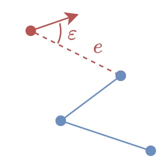
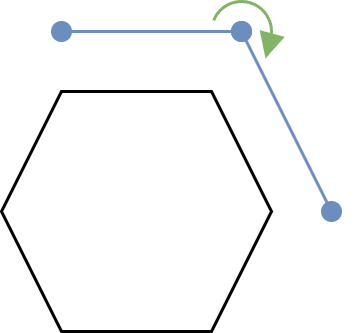
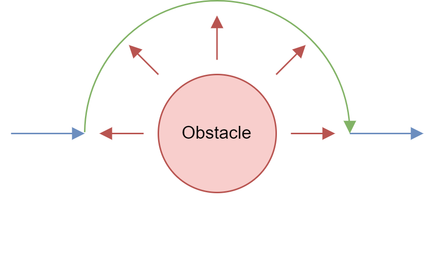
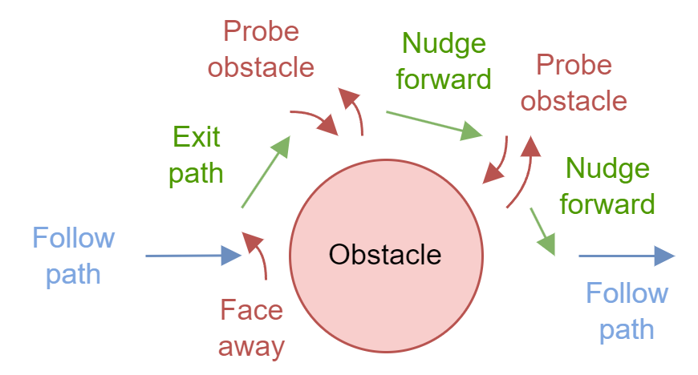
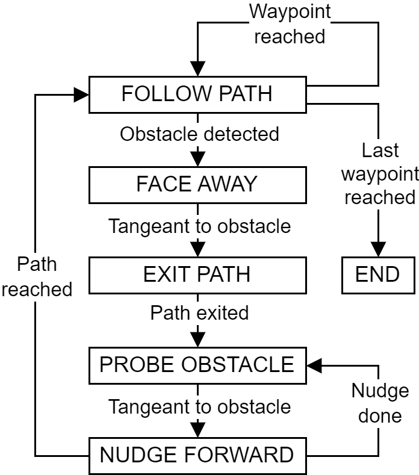

# Local navigation

## Odometry

The Thymio robot in our use case has **3 DOF**, two translational and one rotational : $[x, y, \theta]^T$. The goal is to find the change in position over one time step :
$$
\begin{equation}
\begin{bmatrix}
    x_+ \\
    y_+ \\
    \theta_+
\end{bmatrix} =
\begin{bmatrix}
    x \\
    y \\
    \theta
\end{bmatrix} +
\begin{bmatrix}
    \Delta x \\
    \Delta y \\
    \Delta \theta
\end{bmatrix}
\end{equation}
$$

### Change in heading

When moving one time step, the robot advance by $\Delta d_L$ and $\Delta d_R$ on each wheel. The track width $w$ being constant, this means that they are two arc length of two concentric circles of radiuses $w + r$ and $r$. Assuming $\Delta d_L$ is the interior arc and $\Delta d_R$ the exterior arc, from the definition of the radian $\alpha = d / r$, we can solve the increment in angle that $\Delta d_L$ and $\Delta d_R$ describe :
$$
\begin{align}
\Delta \theta = \frac{\Delta d_L}{r} &= \frac{\Delta d_R}{w + r} \\
\Rightarrow \frac{r}{\Delta d_L} &= \frac{w + r}{\Delta d_R} \\
\Rightarrow r &= \frac{w \cdot \Delta d_L}{\Delta d_R - \Delta d_L} \\
\Rightarrow \Delta \theta &= \frac{\Delta d_R - \Delta d_L}{w}
\end{align}
$$

### Change in position

To integrate the position, the **mid-point rule** also known as **Runge–Kutta 2** (**RK2**) is used. The idea is that the change of coordinate has mainly followed the mid-point heading.
$$
\begin{align}
\theta_{mid} &= \theta + \frac{\Delta \theta}{2} \\
\Delta x &\approx \Delta s \cdot \cos \theta_{mid} \\
\Delta y &\approx \Delta s \cdot \sin \theta_{mid} \\
\end{align}
$$

## Units conversion

### Distance integration

First, we solve the simple case of linear motion in the $x$ direction. From the Thymio cheat sheet we get the constants :
$$
\begin{equation}
\begin{aligned}
\Delta t &= \frac{1}{100 \text{ Hz}} = \frac{10}{1000} \text{ s} \\
v_{mm/s} &= 20 \text{ cm/s} = 200 \text{ mm/s} \\
v_{lsb/s} &= 500 \text{ lsb/s}
\end{aligned}
\end{equation}
$$

To have a large enough full scale range of $\approx \pm 2^{15} = \pm 32'768 \approx \pm 32 \text{ m}$, the initial increment estimation is computed in $\text{mm}$ :
$$
\begin{align}
\Delta d_{mm} &= v_{lsb/s} \cdot \frac{v_{mm/s}}{v_{lsb/s}} \cdot \Delta t \\
&= v_{lsb/s} \cdot \frac{200}{500} \cdot \frac{10}{1000} \\
&= v_{lsb/s} \cdot \frac{2}{500} \\
\end{align}
$$
However, because of fixed point arithmetic, only the speeds $250$ and $500$ can be differentiated. They will respectively give increments of $\pm 1$ and $\pm 2$ on the position estimation, so almost $8$ bits of precision are lost. To take into acount those lost $8$ bits, we must estimate the increment in $\mu m$ :
$$
\begin{equation}
\Delta d_{\mu m} = 1000 \cdot \Delta d_{mm} = v_{lsb/s} \cdot \frac{20}{5} = v_{lsb/s} \cdot 4
\end{equation}
$$

After experimentation and calibration, it turns out that the given speeds in $mm/s$ and $lsb/s$ are not exact. The calibrated integration is closer to :
$$
\begin{equation}
\Delta d_{\mu m} = v_{lsb/s} \cdot 3.1254 = v_{lsb/s} \cdot \frac{31'254}{10'000}
\end{equation}
$$

### Heading integration

We computed earlier that we need to find the following angle increment :
$$
\begin{equation}
\Delta \theta = \frac{\Delta d_R - \Delta d_L}{p} \, rad
\end{equation}
$$

On the Thymio, angles use a fixed point representation in the range $[-\pi, \pi[$ mapped to $[-2^{15}, 2^{15}[$. So one radian is equal to :
$$
1 \, rad = \frac{2^{15}}{\pi} \approx 10'430
$$

If we try to deduce a constant with $p \approx 95'000 \, \mu m$ to compute angles in these units, we get :
$$
\begin{equation}
\Delta \theta = \frac{\Delta d_R - \Delta d_L}{p} \, rad = (\Delta d_R - \Delta d_L) \cdot \frac{2^{15}}{\pi \cdot p} \approx (\Delta d_R - \Delta d_L) \cdot \frac{1098}{10000}
\end{equation}
$$

## Control

### Astolfi

The pose estimation is perfectly suited for an Astolfi controller, with the change of coordiates :
$$
\begin{align}
\rho &= \sqrt{\Delta x^2 + \Delta y^2} \\
\alpha &= \text{atan2}(\Delta y, \Delta x) - \theta \\
\beta &= \Delta \theta -\alpha
\end{align}
$$

Here $\rho$ is the distance to the target, $\alpha$ the robot to target heading error, and $\beta$ the final target heading error. The control law is :
$$
\begin{align}
v &= k_\rho \cdot \rho \\
\omega &= k_\alpha \cdot \alpha + k_\beta \cdot \beta \\
k_\rho &> 0, k_\beta < 0, k_\alpha - k_\rho > 0
\end{align}
$$

This controller offer a nice spline motion, but it gets numerically unstable as the robot reach the goal. When $(\Delta x, \Delta y) \rightarrow (0, 0)$, the function $\text{atan2}$ tends to jump around, and the angles $\alpha$ and $\beta$ tends to fight for angular velocity.

### Custom controller

To fix this the controller is simplified. Only the distance error $e$ and the target heading error $\varepsilon$ are used :
$$
\begin{align}
e &= \sqrt{\Delta x^2 + \Delta y^2} \\
\varepsilon &= \text{atan2}(\Delta y, \Delta x) - \theta
\end{align}
$$

Then, assuming $e \in [0, e_{max}]$ and $\varepsilon \in [-\pi, \pi[$, the controller is modified as :
$$
\begin{align}
v &= k_e \cdot e \cdot (\pi - |\varepsilon|) \\
\omega &= k_\omega \cdot \varepsilon \cdot (e_{max} - e)
\end{align}
$$

This way, the $v$ tends to $0$ if the robot is not heading in the right direction, and $\omega$ tends to $0$ when the target reaches the goal. This prevents the robot from going forward while the target is not in sight, and spinning around when the target is reached.

## Obstacle avoidance

### Strategy

The custom controller follows the path **one waypoint at a time**.

    

Knowing the path was generated with a visibility graph, we can assume each vertex is quite close to an exclusion zone. The avoidance should hence be done on the **path exterior** :

    

When detecting the obstacle with the horizontal proximity sensors, the avoidance trajectory should be pushed away from the obstacle, **tangeant** to the obstacle's **potential field**.

    

### State machine

The proximity sensors being far ahead of the rotation center of the robot, directly implementing a potential field often lead to the robot to touch the obstacle while trying to avoid it. To prevent this, the robot should **probe** for the obstacle **tangeant**, then **nudge one robot length**. It should repeat these two steps until the nudge step intersect with the original path.

    

This mechanism is implemented using a **state machine**. Two states are added to initially exit the path, in order to **avoid detecting a false intersection** with the path from the very start.

    

